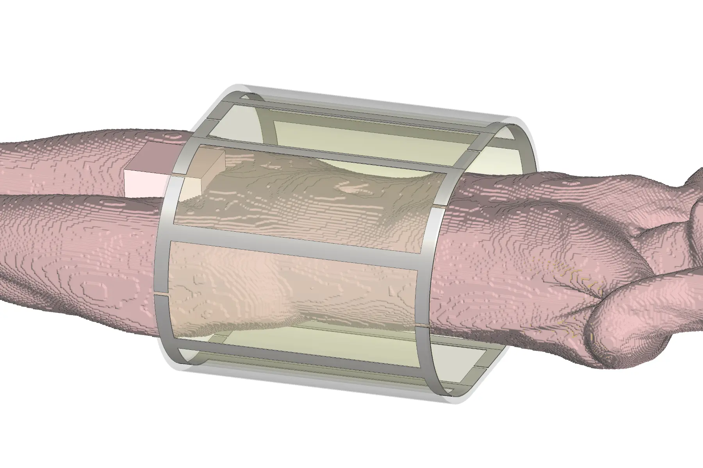

+++
type = 'page'
layout = 'post'
date = '2025-11-27T09:46:24+01:00'
draft = true
title = 'A Post With an Image.md'
slug = 'a-post-with-an-image.md'
lastmod = '2025-11-27T09:46:24+01:00'
tags = ['meta']
description = 'This is a test post to see how images are rendered when linked in the post markdown file.'
publishDate = ''
+++
This is to test the insertion of an image

more text here

